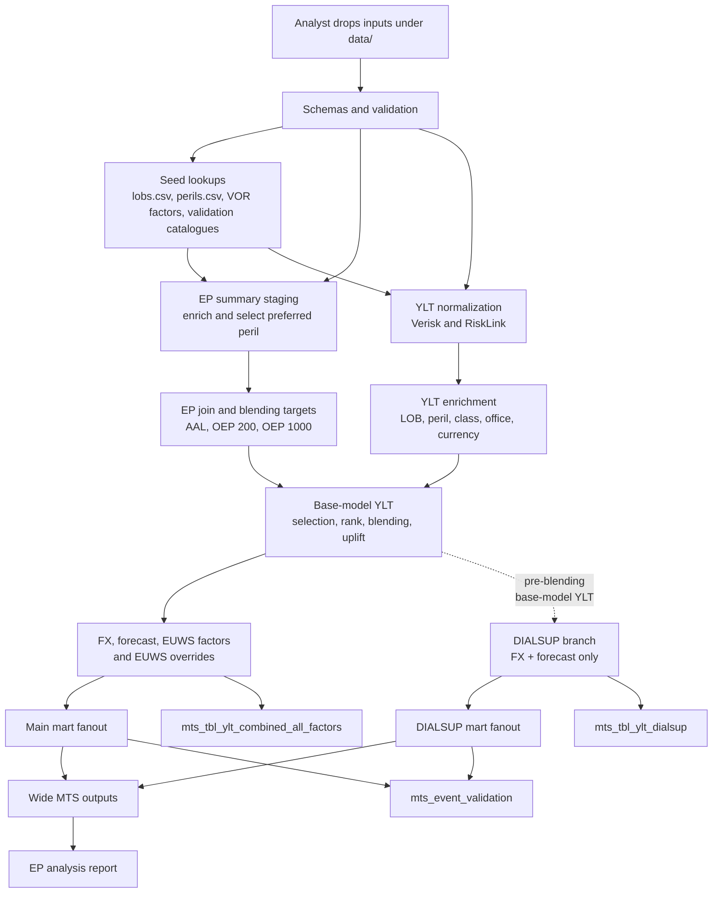

# Architecture

The rollup pipeline ingests vendor catastrophe model outputs (YLTs) and
exceedance probability (EP) summaries, enriches them with reference seed
data, applies business blending and financial factors, and writes mart
outputs for downstream reporting.

## Data flow

## Pipeline phases

| Phase | What happens | Debug prefix |
| --- | --- | --- |
| Seed + validation | Read seed files, event catalogues, YLTs, and EP summaries; report schema and lookup coverage issues. | `seed_*` |
| Staging | Normalize YLT formats and stage EP summaries with LOB/peril enrichment, main peril selection, and DIALSUP peril selection. | `stg_*` |
| Intermediate | Join EP vendors, calculate blend targets, enrich YLT rows, apply blending, FX, forecast, EUWS, EUWS overrides, and build DIALSUP. | `int_*` |
| Marts | Build main/DIALSUP fanouts, long all-factor outputs, event validation, and wide MTS outputs. | `mts_*` |

## Pipeline transforms

| # | Step | Function | Output shape |
| --- | --- | --- | --- |
| 1 | Normalize YLT | `normalize_ylt` | Vendor-specific YLT columns become canonical `vendor`, `modelled_lob`, `modelled_peril`, `loss`, `year_id`, and `event_id` columns. |
| 2 | Stage EP summaries | `stage_ep_summaries` | EP summaries are enriched with LOB/peril seeds and split into main `selection_priority` and DIALSUP `is_dialsup` selections. |
| 3 | Join EP vendors | `join_ep_summaries` | Verisk and RiskLink EP summaries are aggregated at `(rollup_lob, rollup_peril, region_peril_id, ep_type, return_period)` grain. |
| 4 | Calculate blend targets | `calculate_ep_blending_targets` | Blend weights produce `target_loss`, `base_model`, `base_model_loss`, and clamped `uplift_factor_on_base_model`. |
| 5 | Enrich YLT | `enrich_ylt_with_ep_summaries` | YLT rows receive rollup LOB/peril, class, office, currency, and region/peril metadata. |
| 6 | Rank base-model YLT | `_add_rank_columns` | Base-model rows receive `rnk`, `rp`, and `rp_bucket` for blending. |
| 7 | Blend YLT | `apply_ep_blending_to_ylt` | `loss` is uplifted and `metric` becomes `blended`. |
| 8 | Apply FX | `apply_fx_to_ylt` | `loss` is converted to GBP, `target_currency` is attached, and `metric` becomes `gbp`. |
| 9 | Apply forecast | `apply_forecast_to_ylt` | Rows are cross-joined to forecast dates, missing factors default to `1.0`, and `metric` becomes `gbp_forecast`. |
| 10 | Apply EUWS | `apply_euws_to_ylt` | Europe Windstorm factors are applied, model event fields are attached, and `metric` becomes `euws`. |
| 11 | Apply EUWS overrides | `apply_euws_overrides_to_ylt` | Configured zero-factor overrides are applied and `metric` becomes `euws_override`. |
| 12 | Build DIALSUP | `calculate_dialsup` | DIALSUP emits `dialsup_original`, `dialsup_gbp`, and `dialsup_gbp_forecast` metrics. |
| 13 | Build fanouts | `build_main_fanout`, `build_dialsup_fanout` | Final main and DIALSUP metrics are shaped into mart-ready fanout columns. |
| 14 | Write combined outputs | `_write_combined_outputs` | Long all-factor main and DIALSUP parquets are written, then final metrics are pivoted to wide forecast-date columns. |

## Data

The pipeline reads source inputs from a configured data directory:

- **YLT files** — Verisk and RiskLink event-loss tables in parquet format.
- **EP summaries** — Exceedance probability tables in long CSV format,
  one per vendor.
- **Seed files** — Reference lookup tables: line of business and peril
  mappings, VOR factors (blending, forecast, EUWS rate, FX rates), and
  EUWS rank overrides.
- **Event catalogues** — Verisk event definitions and RiskLink flood
  event tables.

## Validation

All inputs are validated before processing. The validation step checks
file schemas against YAML-defined contracts, confirms that YLT rows have
matching EP summary entries and seed lookups, and produces a coverage
report showing any orphaned or missing references. The pipeline stops if
validation fails.

## EP summaries

EP summaries from each vendor are staged into a common format. For each vendor,
rollup LOB, and rollup peril group, the main pipeline selects one modelled peril
by lowest `selection_priority`. This priority is only for the main pipeline. The
summaries are then joined across Verisk and RiskLink vendors to produce a unified
view of EP losses per return-period bucket.

## Blending

The EP-driven blending step calculates target losses per return-period
bucket from the joined vendor summaries, applying configured blending
weights. Events in the YLT are ranked within their vendor-modelled-lob-
rollup-peril group, assigned a return-period bucket, and then matched
to blending targets. Each event's loss is uplifted by the factor
corresponding to its bucket.

This produces the main blended loss stream and also feeds rank
information downstream for the wide output.

For calculation details, see the [calculation reference](calculation-reference.md).

## FX

The blended loss (in the YLT's original currency) is converted to GBP
using configured FX rates joined on currency. This is applied to both
the main pipeline and the DIALSUP branch.

## Forecast

Each YLT row is expanded across all forecast dates via a cross-join,
then matched to forecast factors by class, office, and forecast date.
Missing factors default to 1.0. One input row becomes N output rows,
one per forecast date. This is applied to both the main pipeline and
the DIALSUP branch.

## DIALSUP

The DIALSUP branch runs in parallel with the main pipeline. It takes
base-model losses before blending and EUWS, applies FX conversion and
forecast factors, and produces an independent loss stream.

DIALSUP does not inherit the main pipeline's `selection_priority` winner.
Instead, it uses the active candidate marked `is_dialsup = 1` in
`perils.csv` for each vendor, rollup LOB, and rollup peril group. Validation
fails if an active group has zero or multiple DIALSUP candidates. Mark the
least-adjusted/base peril where possible; adjusted variants such as
GC-adjusted, CVV, floor-area, PLA, or HD should generally be `0` unless an
adjusted or HD row is the only sensible base candidate.

Because DIALSUP can choose a different source peril from the main pipeline,
DIALSUP row counts and wide-output density can differ from the main output and
from earlier runs. The base model is RiskLink for Europe_FL and UK_FL, and
Verisk for other perils. This output is used alongside the main pipeline results
for reporting.

## EUWS

Europe Windstorm (EUWS) factors are applied to Europe_WS peril rows.
Verisk event catalogue joins identify storm events and attach per-event
EUWS rate factors. Non-windstorm rows receive a factor of 1.0.

## EUWS overrides

Top-ranked events that receive a zero EUWS factor can have their factor
overridden to a configured value via the EUWS rank overrides seed file.
This prevents high-ranking events from being unfairly reduced to zero
loss.

## Outputs

**Long output** (`mts_tbl_ylt_combined_all_factors.parquet`): one row
per metric and event/forecast-date combination, with `metric`, `loss`,
and the available contributing factor columns.

**Wide output** (`mts_tbl_ylt_combined_all_factors_wide.parquet`): the
long data pivoted so each forecast date becomes a separate column per
metric — e.g. `euws_override_202601_loss`,
`dialsup_gbp_forecast_202601_loss`. Dimension columns are all non-
metric, non-forecast-date, non-loss columns present in both the main
and DIALSUP frames.

**Fanouts**: mart-ready tables with standardised column names (event
ID, year, currency, gross loss, event day) for the final main metric
and final DIALSUP metric.

**Event validation**: a report grouped by base model, metric, and
forecast date. For each group it reports row count, missing model event
IDs, and missing model event days.

Normal runs write only final outputs. Use `uv run rollup run --debug`
when you need intermediate parquet frames in `output/debug/`.
