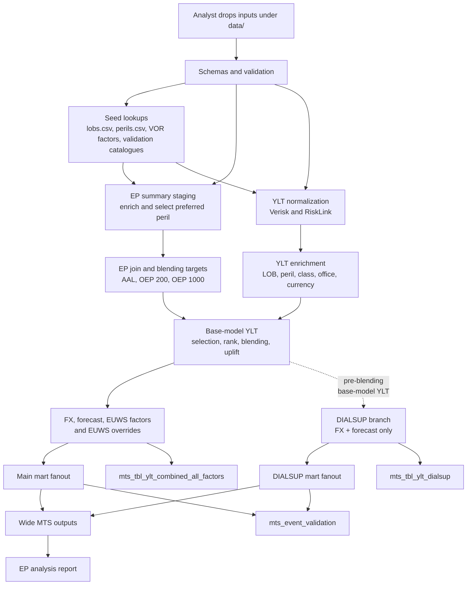

# Architecture

The rollup pipeline is a file-based batch process. Analysts drop source inputs
under `data/`; the CLI validates them, enriches vendor YLT rows with seed
lookups, derives EP-driven blend factors, applies business factors, and writes
mart/report outputs under root `output/`.

## Data flow

## Pipeline phases

| Phase | What happens | Debug prefix |
| --- | --- | --- |
| Seed + validation | Read seed files, event catalogues, YLTs, and EP summaries; report schema and lookup coverage issues. | `seed_*` |
| Staging | Normalize YLT formats and stage EP summaries with LOB/peril enrichment and preferred modelled peril selection. | `stg_*` |
| Intermediate | Join EP vendors, calculate blend targets, enrich YLT rows, apply blending, FX, forecast, EUWS, and build DIALSUP. | `int_*` |
| Marts | Build main/DIALSUP fanouts, combined-all-factors output, event validation, and wide MTS. | `mts_*` |

## Forecast factor and output shaping

The forecast step expands each YLT row across all forecast dates:

1. All unique `forecast_date` values from `forecast_factors.csv` are extracted.
2. Each YLT row is cross-joined with those dates — 1 input row becomes N output rows.
3. The forecast factor is left-joined on `(class, office, forecast_date)`. Missing factors default to `1.0`.
4. The forecasted loss = `original_ylt_loss_blended_gbp * forecast_factor`.

**Long output** (`mts_tbl_ylt_combined_all_factors.parquet`): one row per (event × forecast_date), with columns for each intermediate loss stage (`original_ylt_loss`, `_blended`, `_gbp`, `_forecast`, `_euws`) and the contributing factor values (`forecast_factor`, `fx_rate`, `euws_factor`, `uplift_factor_on_base_model`).

**Wide output** (`mts_tbl_ylt_combined_all_factors_wide.parquet`): the same data pivoted so each forecast date becomes a separate column per metric — e.g. `main_202601_loss`, `main_202602_loss`, `dialsup_202601_loss`. Dimension columns (vendor, rollup_lob, rollup_peril, etc.) remain as row identifiers.

Normal runs write only final outputs. Use `uv run rollup run --debug` when you
need intermediate parquet frames in `output/debug/`.
