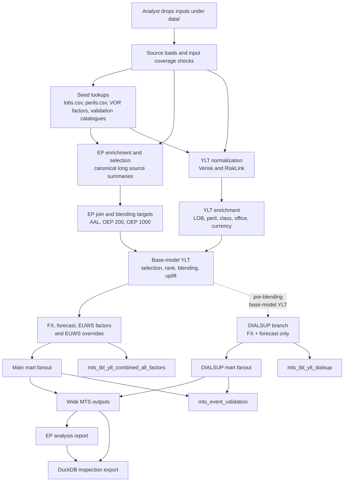

# Architecture

The rollup pipeline ingests vendor catastrophe model outputs (YLTs) and
exceedance probability (EP) summaries, enriches them with reference seed
data, applies business blending and financial factors, and writes mart
outputs for downstream reporting.

## Data flow

## Pipeline phases

The code is arranged in a dbt-like physical layout while remaining a Polars
LazyFrame pipeline, not a dbt/SQL pipeline:

- `src/rollup/sources/` modules expose one public operation: `load(data_root)`.
  The name is conventional; source loading returns Polars `LazyFrame` scans and
  does not collect rows. Source modules own file discovery and immediate source
  validation such as duplicate seed stems, missing YLT vendor parquets, and EP
  summary vendor-folder/schema recognition. Automatic recursive seed discovery
  lives in `sources/seeds.py`; canonical `*.long.csv` EP summary discovery and
  vendor derivation live in `sources/ep_summaries.py`.
  Current source entry points are exactly:

  - `seeds.load(data_root)` for recursive seed CSV/parquet discovery keyed by
    filename stem.
  - `ylt.load(data_root)` for required top-level Verisk/RiskLink YLT parquets.
  - `ep_summaries.load(data_root)` for canonical long EP CSV validation and
    combination.
- `src/rollup/staging/` canonicalizes real raw transforms only: Verisk/RiskLink
  YLTs, event catalogues, GBP FX rates, and forecast factors. EP summaries and
  canonical seeds feed intermediate models directly rather than through
  pass-through staging models.
- `src/rollup/intermediate/` contains cumulative business transforms. EP
  enrichment/selection, YLT union, forecast dates, EP blending, and the explicit
  main/DIALSUP YLT branches are each represented by semantic `int_*` model
  modules. `int_ylt_enriched`, `int_ylt_base_selected`, and `int_ylt_ranked` are
  direct reusable operations invoked separately for main and DIALSUP inputs.
- `src/rollup/marts/` contains pure mart transformations for fanout, validation,
  and long-output filtering/tagging. These modules do not write files.
- `src/rollup/writers/` owns materialization to parquet, debug files, fanout
  partitions, wide output, and DuckDB. Product writer modules expose
  `validate(...) -> None` and `write(...)`; `writers/wide_output.py` owns the
  isolated DuckDB subprocess used for wide MTS output materialization.
- `src/rollup/pipeline.py` is orchestration only. It imports model modules and
  calls `module.transform(...)`; it owns work-parquet materialization/re-scan,
  debug registration, and writer calls, not model business logic.

## Model contract

Each public staging, intermediate, and mart model is one semantic Polars model
per file. The module is the model: it exposes `validate(...) -> None` and
`transform(...) -> pl.LazyFrame`, and `transform()` calls its own `validate()`.
There is no abstract model class, registry, context container, dynamic discovery,
or sequence-number filename convention.

Model validation is schema-only. It uses `LazyFrame.collect_schema()` and helper
checks for required columns, important dtype families, join-key compatibility,
and output-plan schema resolution. Model output schema checking calls
`validate_output(model, frame)`, then returns `frame` explicitly. It must not
collect rows or perform null, uniqueness, range, or cardinality checks; those
belong in data-quality validation/tests.

Model names are semantic and import-safe, using `stg_`, `int_`, and `mart_`
prefixes without numeric ordering. Pipeline dependencies explicitly define
execution order. Models do not perform file, DuckDB, or subprocess I/O; sources
read inputs and writers write outputs.

| Phase | What happens | Debug prefix |
| --- | --- | --- |
| Sources | Load canonical source inputs as lazy Polars scans, including `src_ep_summaries` from `data/ep_summaries/{verisk,risklink}/**/*.long.csv`. | `src_*` |
| Seed + validation | Load seed files, event catalogues, and YLTs as lazy inputs; report required input/seed presence and lookup coverage issues. | `seed_*` |
| Staging | Canonicalize raw logical sources: vendor YLTs, event catalogues, GBP FX rates, and forecast factors. | `stg_*` |
| Intermediate | Union YLTs; enrich/select EP summaries; derive forecast dates; join EP vendors; select target points; prepare blend weights; calculate blend targets; enrich and rank YLT rows; apply main blending, FX, forecast, EUWS, and EUWS overrides; apply DIALSUP FX and forecast. | `int_*` |
| Marts | Build main/DIALSUP long outputs, fanouts, and event validation without writing files. | `mts_*` |

Debug registration follows the same layers. The pipeline records semantic
suffixes such as `ep_summaries` or `ylt_main_ranked`; the debug writer adds
`src_`, `seed_`, `stg_`, `int_`, or `mts_`. Non-model compatibility artifacts
are not written.

## Pipeline transforms

| # | Step | Model(s) | Output shape |
| --- | --- | --- | --- |
| 1 | Stage raw sources | `stg_verisk_ylt.transform()`, `stg_risklink_ylt.transform()`, `stg_verisk_events.transform()`, `stg_risklink_flood_events.transform()`, `stg_gbp_fx_rates.transform()`, `stg_forecast_factors.transform()` | Raw logical sources are renamed, cast, and cleaned into canonical staging schemas. EP source rows feed enrichment directly. |
| 2 | Normalize YLT | `int_ylt_normalized.transform()` | Vendor-specific YLT rows are unioned into canonical `vendor`, `modelled_lob`, `modelled_peril`, `loss`, `year_id`, and `event_id` columns. |
| 3 | Enrich and select EP summaries | `int_ep_summaries_enriched.transform()`, `int_ep_summaries_main.transform()`, `int_ep_summaries_dialsup.transform()` | EP summaries are enriched with LOB/peril seeds, then split into main `selection_priority` and DIALSUP `is_dialsup` selections. |
| 4 | Prepare shared dates/factors | `int_forecast_dates.transform()` plus staged FX/forecast models | Distinct forecast dates are prepared once for both branches; FX and forecast factors are already staged. |
| 5 | Join EP vendors | `int_ep_vendor_joined.transform()` | Verisk and RiskLink EP summaries are aggregated at `(rollup_lob, rollup_peril, region_peril_id, blend_subregion_peril_id, base_model, ep_type, return_period)` grain. |
| 6 | Calculate EP blending targets | `int_ep_blending_target_points.transform()`, `int_ep_blending_weights.transform()`, `int_ep_blending_targets.transform()` | Target points and weights produce vendor contributions, `target_loss`, `base_model_loss`, and clamped `uplift_factor_on_base_model`. |
| 7 | Build main YLT stream | `int_ylt_enriched.transform()`, `int_ylt_base_selected.transform()`, `int_ylt_ranked.transform()`, `int_ylt_main_blended.transform()`, `int_ylt_main_local_currency.transform()`, `int_ylt_main_forecast.transform()`, `int_ylt_main_euws.transform()`, `int_ylt_main_euws_override.transform()`, `int_ylt_main_metric_stream.transform()` | Main rows receive EP metadata, base selection, rank buckets, EP blending uplift, local-currency conversion, forecast expansion, EUWS factors, overrides, and a combined metric stream. |
| 8 | Build DIALSUP stream | `int_ylt_enriched.transform()`, `int_ylt_base_selected.transform()`, `int_ylt_ranked.transform()`, `int_ylt_dialsup_factor_base.transform()`, `int_ylt_dialsup_original_metric.transform()`, `int_ylt_dialsup_local_currency_metric.transform()`, `int_ylt_dialsup_forecast_metric.transform()`, `int_ylt_dialsup_metric_stream.transform()` | DIALSUP reuses enrichment/base-selection/ranking operations with DIALSUP-selected EP rows, attaches shared factors once, emits original/local-currency/forecast metrics, and unions them into an independent stream. |
| 9 | Build marts | `mart_ylt_main_long.transform()`, `mart_ylt_dialsup_long.transform()`, `mart_main_fanout.transform()`, `mart_dialsup_fanout.transform()`, `mart_event_validation.transform()` | Main long keeps final `cds_main` rows plus `intermediate_audit` audit metrics. DIALSUP long keeps final `dialsup_localccy_forecast` rows and tags them `cds_dialsup`. Fanouts are shaped from those fixed long contracts, then summarized for event validation. `_fanout_helpers.py` holds shared fanout construction. |
| 10 | Write product outputs | `parquet.write()`, `wide_output.write()`, `fanout_partitions.write()` | Pipeline directly calls writers: a small fixed loop writes main-long, DIALSUP-long, and event-validation parquets; homogeneous loops write debug frames and fanout partitions. There is no aggregate mart-output wrapper and no filesystem discovery hidden in pipeline execution. |

## Data

The pipeline reads source inputs from a configured data directory:

- **YLT files** — Verisk and RiskLink event-loss tables in parquet format.
- **EP summaries** — Exceedance probability tables in long CSV format under
  canonical vendor roots `data/ep_summaries/verisk/` and
  `data/ep_summaries/risklink/`. At least one `*.long.csv` is required under
  both roots. Nested long files below those roots are scanned. Each file must use
  the exact canonical long schema. Vendor is derived only from the canonical root
  folder and overwrites any in-file vendor value; unknown, root-level, and
  case-variant vendor folders are rejected.
- **Seed files** — Reference lookup tables discovered recursively under
  `data/seeds/` for both CSV and parquet by `seeds.load(data_root)`. Runtime seed
  keys are simply the file stem, for example `lobs`, `perils`, `fx_rates`, or
  `verisk_events`. Duplicate stems are rejected during source loading.
- **Event catalogues** — Verisk event definitions and RiskLink flood
  event tables.

## Validation

`rollup validate` calls `validation.inspect_inputs(...)` to load sources lazily and
build coverage reports, then `validation.validate_inputs(...)` to reject blocking
input errors. It checks required source folders, required YLT/source presence,
required seed inventory, and modelled LOB/peril coverage for EP summaries and YLT
data. Modelled LOB/peril anti-join rows are blocking. The command also reports
input YLT AAL by vendor/LOB/peril for information. Expected input failures return
non-zero with concise stderr; the CLI does not execute the colocated Validnator
YAML schema contracts, which remain external/reference contracts.

## EP summaries

Canonical long EP summaries from each vendor are enriched directly with seed
dimensions in `int_ep_summaries_enriched`. For each vendor, rollup LOB, and
rollup peril group, the main pipeline then selects one modelled peril by lowest
`selection_priority`. This priority is only for the main pipeline. The selected
summaries are then joined across Verisk and RiskLink vendors to produce a unified
view of EP losses per return-period bucket.

## Blending

The EP-driven blending step calculates target losses per return-period
bucket from the joined vendor summaries, applying configured blending
weights. Events in the YLT are ranked within their vendor-modelled-lob-
rollup-peril group, assigned a return-period bucket, and then matched
to blending targets. Each event's loss is uplifted by the factor
corresponding to its bucket.

This produces the main blended loss stream and also feeds rank
information downstream for the wide output.

For calculation details, see the [calculation reference](calculation-reference.md).

## FX

YLT losses are expected to arrive in GBP. The FX step converts those GBP losses
to the LOB local currency from `business/lobs.csv`. The seed rates in
`vor/fx_rates.csv` are stored as `currency -> GBP`; the pipeline inverts that
rate when outputting local currency. This is applied to both the main pipeline
and the DIALSUP branch.

## Forecast

Each YLT row is expanded across all forecast dates via a cross-join,
then matched to forecast factors by class, office, and forecast date.
Missing factors default to 1.0. One input row becomes N output rows,
one per forecast date. This is applied to both the main pipeline and
the DIALSUP branch.

## DIALSUP

The DIALSUP branch runs in parallel with the main pipeline. It takes
base-model losses before blending and EUWS, applies FX conversion and
forecast factors, and produces an independent loss stream.

DIALSUP does not inherit the main pipeline's `selection_priority` winner.
Instead, it uses the active candidate marked `is_dialsup = 1` in
`perils.csv` for each vendor, rollup LOB, and rollup peril group. Mark the
least-adjusted/base peril candidates where possible; adjusted variants such as
GC-adjusted, CVV, floor-area, PLA, or HD should generally be `0` unless an
adjusted or HD row is the only sensible base candidate.

Because DIALSUP can choose a different source peril from the main pipeline,
DIALSUP row counts can differ from the main output and
from earlier runs. The base model is RiskLink for Europe_FL and UK_FL, and
Verisk for other perils. This output is used alongside the main pipeline results
for reporting.

## EUWS

Europe Windstorm (EUWS) factors are applied to Europe_WS peril rows.
Verisk event catalogue joins identify storm events and attach per-event
EUWS rate factors. Non-windstorm rows receive a factor of 1.0.

## EUWS overrides

Top-ranked events that receive a zero EUWS factor can have their factor
overridden to a configured value via the EUWS rank overrides seed file.
This prevents high-ranking events from being unfairly reduced to zero
loss.

## Outputs

Output paths are composed directly from fixed constants in
`src/rollup/output_contract.py`, such as `COMBINED_YLT_FILE`, `MARTS_DIR`, and
`EP_REPORT_FILE`. There are no public output-path helper functions.

**Long output** (`mts_tbl_ylt_combined_all_factors.parquet`): main-branch rows
with one row per metric and event/forecast-date combination, `metric`, `loss`,
`output_use`, and the available contributing factor columns. Final
`euws_override` rows are tagged `cds_main`; other retained metrics are tagged
`intermediate_audit`.

**Wide output** (`mts_tbl_ylt_combined_all_factors_wide.parquet`): the
fixed wide contract written by `writers/wide_output.py`. It has 25 identity
dimensions from `output_contract.WIDE_IDENTITY_DIMENSIONS`, constant
`output_use = 'cds_wide_analysis'`, three blend diagnostic columns, then dynamic
loss columns ordered by forecast date — e.g. `euws_override_202601_loss`,
`dialsup_localccy_forecast_202601_loss`. Unknown input columns do not become
dimensions. Missing contract columns and duplicate `(identity dimensions,
metric, forecast_date)` grains fail before or during materialization.

**DIALSUP output** (`mts_tbl_ylt_dialsup.parquet`): final DIALSUP rows only,
with `metric = dialsup_localccy_forecast`.

**Fanouts**: mart-ready tables with standardised column names (event
ID, year, currency, gross loss, event day) for the final main metric
and final DIALSUP metric.

**Event validation**: a report grouped by base model, metric, and
forecast date. For each group it reports row count, missing model event
IDs, and missing model event days.

**DuckDB export** (`output/rollup.duckdb`): an inspection artifact, not a new
calculation output. It packages generated root `mts_tbl_*.parquet` files using a
shallow output-root glob, shallow mart fanout parquets from `output/marts/`,
recursive CSV/parquet seed files, and `ep_report` when present. Each table name
is the file stem, safely quoted for DuckDB; duplicate table names are rejected.
Validation YAML files and raw input YLTs are not exported.

Wide materialization stays in a separate `python -m rollup.writers.wide_output`
DuckDB subprocess to contain memory. The worker uses one filtered aggregate/COPY
query, spills and writes temporary files next to the final output, then atomically
replaces the final parquet. Fanout temporary materialization is also created on
the output filesystem and removed by its temporary-directory context.

Durable outputs are failure-safe at their owning writer boundary, not whole-run
transactional. Core parquets, the wide parquet, DuckDB export, fanout partitions,
generated EP long CSVs, the analysis EP report, and validation report CSVs are
staged on the destination filesystem and replace final outputs only after
successful generation. Existing good outputs survive pre-publication failures.
Fanout internals remain temporary; only `Hisco*.parquet` products are published to
`output/marts/`.

The pipeline creates an output-local temporary `rollup-work-*` directory for
materialization and removes it automatically on success or failure.

Normal runs write only final outputs. Use `uv run rollup run --debug`
when you need intermediate parquet frames in `output/debug/`.
