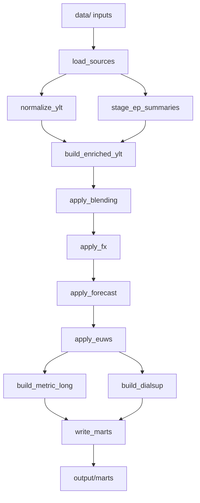

# Architecture

The rollup runtime is a Python package under `src/rollup/`. Dataiku and local
CLI users call the same programmatic API, so local smoke tests exercise the same
calculation path used in production-style runs.

## Runtime layers

| Layer | Module | Purpose |
| --- | --- | --- |
| API | `rollup.api` | Public functions: `run_rollup`, `convert_ep_summary`, `convert_ep_summaries`, output path collection, EP report helper. |
| CLI | `rollup.cli` | Thin local runner around the API. Adds flags, log setup, and summary printing. |
| Config | `rollup.config` | Dataiku-friendly defaults plus optional TOML overrides. |
| Staging | `rollup.staging` | Source loading, YLT normalization, EP summary enrichment. |
| Intermediate | `rollup.intermediate` | Blending, FX, forecast, EUWS, metric-long, and DIALSUP calculations. |
| Marts | `rollup.marts` | Parquet outputs, wide pivot, and fanouts. |
| Export | `rollup.duckdb_export` | Optional DuckDB snapshot of selected marts and inputs. |

## Data grain

- Verisk YLTs provide modelled dimensions directly from the vendor export.
- RiskLink raw YLTs are keyed by `analysis_id`; modelled dimensions should come
  from EP-summary enrichment.
- EP summaries are the bridge from vendor/modelled dimensions to rollup LOB,
  rollup peril, class, office, currency, and region peril metadata.

## Branches

The main branch builds the combined all-factors mart:

1. original YLT loss
2. blended loss
3. blended FX loss
4. blended FX forecast loss
5. blended FX forecast EUWS override loss

The DIALSUP branch is separate. It selects rows with `is_dialsup == 1` and uses
original YLT loss × FX × forecast. It does not use blended or EUWS-adjusted loss.

## Outputs

All default runtime outputs are written under `output/`; marts are under
`output/marts/`. See [Runtime guide](runtime.md#output-layout) for the exact
layout and [Runtime guide](runtime.md#wide-output-contract) for the wide mart
contract.

## Known architecture follow-up

`Pen` and `Cherish` RiskLink output rows currently have null `modelled_lob` and
`modelled_peril` despite EP summaries containing `MGA_Pen` and `MGA_Cherish`.
Likely follow-up: preserve those fields when `build_enriched_ylt` joins RiskLink
rows by `analysis_id`.
