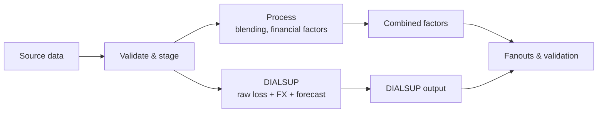

# Architecture

The rollup pipeline ingests vendor catastrophe model outputs (YLTs) and
exceedance probability (EP) summaries, enriches them with reference seed
data, applies business blending and financial factors, and writes mart
outputs for downstream reporting.

## Data flow

## Pipeline phases

| Phase | What happens |
| --- | --- |
| Validate + stage | Read seeds, YLTs, and EP summaries; normalise vendor formats; enrich with reference data; validate schemas and lookup coverage. |
| Blending | Join EP vendors, compute blend targets per return-period bucket, rank YLT events, apply uplift factors. |
| DIALSUP | Build the DIALSUP branch — Verisk raw loss with FX conversion and forecast factors applied (no blending or EUWS). |
| Financial factors | Convert blended loss to GBP via FX rates, cross-join forecast dates with class/office multipliers, apply Europe Windstorm event factors and EUWS rank overrides. |
| Marts | Build main and DIALSUP fanouts, assemble the combined all-factors long output with all intermediate loss stages row-stacked by metric, pivot into wide format with forecast dates as columns, and generate an event validation report. |

## Forecast factor and output shaping

The forecast step expands each YLT row across all forecast dates:

1. All unique `forecast_date` values from `forecast_factors.csv` are extracted.
2. Each YLT row is cross-joined with those dates — 1 input row becomes N output rows.
3. The forecast factor is left-joined on `(class, office, forecast_date)`. Missing factors default to `1.0`.
4. The forecasted loss = `original_ylt_loss_blended_gbp * forecast_factor`.

**Long output** (`mts_tbl_ylt_combined_all_factors.parquet`): one row per (event × forecast_date), with columns for each intermediate loss stage (`original_ylt_loss`, `_blended`, `_gbp`, `_forecast`, `_euws`) and the contributing factor values (`forecast_factor`, `fx_rate`, `euws_factor`, `uplift_factor_on_base_model`).

**Wide output** (`mts_tbl_ylt_combined_all_factors_wide.parquet`): the same data pivoted so each forecast date becomes a separate column per metric — e.g. `euws_override_202601_loss`, `dialsup_gbp_forecast_202601_loss`. Dimension columns are all non-metric, non-forecast-date, non-loss columns present in both the main and DIALSUP frames.

Normal runs write only final outputs. Use `uv run rollup run --debug` when you
need intermediate parquet frames in `output/debug/`.
