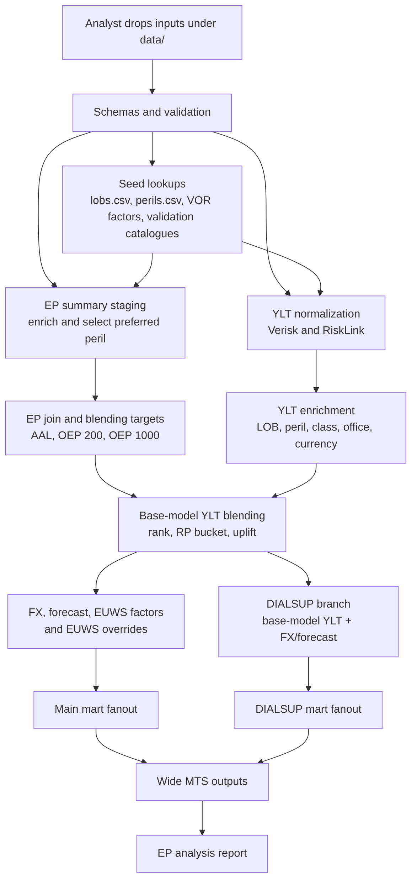

# Architecture

The rollup pipeline is a file-based batch process. Analysts drop source inputs
under `data/`; the CLI validates them, enriches vendor YLT rows with seed
lookups, derives EP-driven blend factors, applies business factors, and writes
mart/report outputs under root `output/`.

## Data flow

## Pipeline phases

| Phase | What happens | Debug prefix |
| --- | --- | --- |
| Seed + validation | Read seed files, event catalogues, YLTs, and EP summaries; report schema and lookup coverage issues. | `seed_*`, `stg_validation_*` |
| Staging | Normalize YLT formats and stage EP summaries with LOB/peril enrichment and preferred modelled peril selection. | `stg_*` |
| Intermediate | Join EP vendors, calculate blend targets, enrich YLT rows, apply blending, FX, forecast, EUWS, and build DIALSUP. | `int_*` |
| Marts | Build main/DIALSUP fanouts, event validation, and wide MTS outputs. | `mts_*` |

Normal runs write only final outputs. Use `uv run rollup run --debug` when you
need intermediate parquet frames in `output/debug/`.
