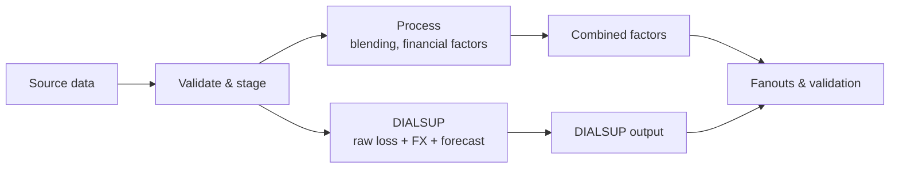

# Architecture

The rollup pipeline ingests vendor catastrophe model outputs (YLTs) and
exceedance probability (EP) summaries, enriches them with reference seed
data, applies business blending and financial factors, and writes mart
outputs for downstream reporting.

## Data flow

## Data

The pipeline reads source inputs from a configured data directory:

- **YLT files** — Verisk and RiskLink event-loss tables in parquet format.
- **EP summaries** — Exceedance probability tables in long CSV format,
  one per vendor.
- **Seed files** — Reference lookup tables: line of business and peril
  mappings, VOR factors (blending, forecast, EUWS rate, FX rates), and
  EUWS rank overrides.
- **Event catalogues** — Verisk event definitions and RiskLink flood
  event tables.

## Validation

All inputs are validated before processing. The validation step checks
file schemas against YAML-defined contracts, confirms that YLT rows have
matching EP summary entries and seed lookups, and produces a coverage
report showing any orphaned or missing references. The pipeline stops if
validation fails.

## EP summaries

EP summaries from each vendor are staged into a common format. For each
vendor-rollup-peril combination, a single preferred modelled peril is
selected. The summaries are then joined across Verisk and RiskLink
vendors to produce a unified view of EP losses per return-period bucket.

## Blending

The EP-driven blending step calculates target losses per return-period
bucket from the joined vendor summaries, applying configured blending
weights. Events in the YLT are ranked within their vendor-modelled-lob-
rollup-peril group, assigned a return-period bucket, and then matched
to blending targets. Each event's loss is uplifted by the factor
corresponding to its bucket.

This produces the main blended loss stream and also feeds rank
information downstream for the wide output.

## FX

The blended loss (in the YLT's original currency) is converted to GBP
using configured FX rates joined on currency. This is applied to both
the main pipeline and the DIALSUP branch.

## Forecast

Each YLT row is expanded across all forecast dates via a cross-join,
then matched to forecast factors by class, office, and forecast date.
Missing factors default to 1.0. One input row becomes N output rows,
one per forecast date. This is applied to both the main pipeline and
the DIALSUP branch.

## DIALSUP

The DIALSUP branch runs in parallel with the main pipeline. It takes
Verisk raw losses (before blending and EUWS), applies FX conversion
and forecast factors, and produces an independent loss stream. This
output is used alongside the main pipeline results for reporting.

## EUWS

Europe Windstorm (EUWS) factors are applied to Europe_WS peril rows.
Verisk event catalogue joins identify storm events and attach per-event
EUWS rate factors. Non-windstorm rows receive a factor of 1.0.

## EUWS overrides

Top-ranked events that receive a zero EUWS factor can have their factor
overridden to a configured value via the EUWS rank overrides seed file.
This prevents high-ranking events from being unfairly reduced to zero
loss.

## Outputs

**Long output** (`mts_tbl_ylt_combined_all_factors.parquet`): one row
per (event × forecast_date), with columns for each intermediate loss
stage and the contributing factor values.

**Wide output** (`mts_tbl_ylt_combined_all_factors_wide.parquet`): the
long data pivoted so each forecast date becomes a separate column per
metric — e.g. `euws_override_202601_loss`,
`dialsup_gbp_forecast_202601_loss`. Dimension columns are all non-
metric, non-forecast-date, non-loss columns present in both the main
and DIALSUP frames.

**Fanouts**: mart-ready tables with standardised column names (event
ID, year, currency, gross loss, event day) for the main and DIALSUP
streams.

**Event validation**: a report comparing events present in both fanouts.

Normal runs write only final outputs. Use `uv run rollup run --debug`
when you need intermediate parquet frames in `output/debug/`.
