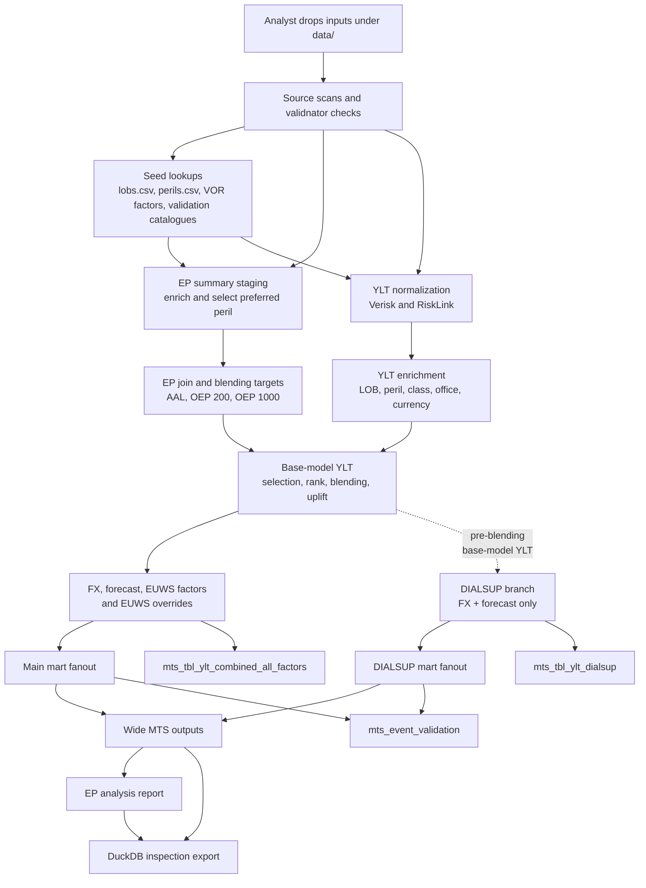

# Architecture

The rollup pipeline ingests vendor catastrophe model outputs (YLTs) and
exceedance probability (EP) summaries, enriches them with reference seed
data, applies business blending and financial factors, and writes mart
outputs for downstream reporting.

## Data flow

## Pipeline phases

The code is arranged in a dbt-like physical layout while remaining a Polars
LazyFrame pipeline, not a dbt/SQL pipeline:

- `src/rollup/sources/` discovers/scans CSV and parquet sources, including a
  simple recursive seed loader and a single EP summary source union.
- `src/rollup/staging/` contains rename, cast, clean, seed-enrichment, and shared
  factor staging models such as `stg_factors.py`.
- `src/rollup/intermediate/` contains cumulative business transforms: EP vendor
  joins and explicit target/weight/blend calculations in `int_ep.py`, the main
  YLT path in `int_ylt_main.py`, and the DIALSUP branch in `int_ylt_dialsup.py`.
- `src/rollup/marts/` contains pure mart transformations for fanout, validation,
  and wide-output column shaping. These modules do not write files.
- `src/rollup/writers/` owns materialization to parquet, debug files, fanout
  partitions, and DuckDB. `writers/wide_outputs.py` owns the DuckDB subprocess and
  filesystem writes for long, DIALSUP, and wide MTS output materialization.
- `src/rollup/pipeline.py` is orchestration only. It wires phases together and no
  longer re-exports private/model compatibility symbols.

| Phase | What happens | Debug prefix |
| --- | --- | --- |
| Seed + validation | Read seed files, event catalogues, YLTs, and EP summaries; report schema and lookup coverage issues. | `seed_*` |
| Staging | Normalize YLT formats; enrich EP summaries; select main and DIALSUP EP summary rows; stage shared FX and forecast factors. | `stg_*` |
| Intermediate | Join EP vendors; select target points; prepare blend weights; calculate blend targets; enrich and rank YLT rows; apply main blending, FX, forecast, EUWS, and EUWS overrides; apply DIALSUP FX and forecast. | `int_*` |
| Marts | Build main/DIALSUP fanouts and event validation; shape wide-output dimensions and column order without writing files. | `mts_*` |

## Pipeline transforms

| # | Step | Function | Output shape |
| --- | --- | --- | --- |
| 1 | Normalize YLT | `normalize_ylt` | Vendor-specific YLT columns become canonical `vendor`, `modelled_lob`, `modelled_peril`, `loss`, `year_id`, and `event_id` columns. |
| 2 | Stage EP summaries | `enrich_ep_summaries`, `select_main_ep_summaries`, `select_dialsup_ep_summaries` | EP summaries are enriched with LOB/peril seeds, then split into main `selection_priority` and DIALSUP `is_dialsup` selections. |
| 3 | Stage shared factors | `stg_gbp_fx_rates`, `stg_forecast_factors`, `stg_forecast_dates` | FX rates are limited to GBP targets, forecast factors are normalized to class/office/date, and distinct forecast dates are prepared once for both branches. |
| 4 | Join EP vendors | `join_ep_summaries` | Verisk and RiskLink EP summaries are aggregated at `(rollup_lob, rollup_peril, region_peril_id, blend_subregion_peril_id, base_model, ep_type, return_period)` grain. |
| 5 | Select EP target points | `select_ep_blending_target_points` | Configured EP type/return-period target rows are selected for blending. |
| 6 | Prepare blend weights | `select_blending_factor_seed`, `prepare_ep_blending_weights` | The blending seed is selected and converted to rollup weight columns for RiskLink and Verisk. |
| 7 | Calculate blend targets | `calculate_ep_blending_targets` | Target points and weights produce vendor contributions, `target_loss`, `base_model_loss`, and clamped `uplift_factor_on_base_model`. |
| 8 | Enrich YLT | `enrich_ylt_with_ep_summaries` | Main and DIALSUP YLT rows receive rollup LOB/peril, class, office, currency, and region/peril metadata from their selected EP summaries. |
| 9 | Rank base-model YLT | `rank_ylt` | Base-model rows receive `rnk`, `rp`, and `rp_bucket` for blending and downstream diagnostics. |
| 10 | Blend main YLT | `apply_ep_blending_to_ylt` | Main `loss` is uplifted from EP blend targets and `metric` becomes `blended`. |
| 11 | Apply main FX | `convert_ylt_to_local_currency` | Main `loss` is expected to be GBP and is converted to LOB local currency using `currency -> GBP` seed rates; `metric` becomes `localccy`. |
| 12 | Apply main forecast | `apply_forecast_factors_to_ylt` | Main rows are cross-joined to forecast dates, missing factors default to `1.0`, and `metric` becomes `localccy_forecast`. |
| 13 | Apply main EUWS | `apply_euws_factors_to_ylt` | Europe Windstorm factors are applied, model event fields are attached, and `metric` becomes `euws`. |
| 14 | Apply main EUWS overrides | `apply_euws_overrides_to_ylt` | Configured zero-factor overrides are applied and `metric` becomes `euws_override`. |
| 15 | Build DIALSUP metrics | `enrich_dialsup_ylt_with_factors`, `convert_dialsup_to_local_currency`, `apply_forecast_factors_to_dialsup_ylt`, `drop_dialsup_factor_columns` | DIALSUP uses its selected base-model rows, attaches shared factors once, emits `dialsup_original`, converts to `dialsup_localccy`, then applies forecast factors to emit `dialsup_localccy_forecast`. |
| 16 | Build fanouts and validation | `build_fanout`, `build_event_validation_report` | Final main and DIALSUP metrics are shaped into mart-ready fanout columns, then summarized for event validation. |
| 17 | Write combined outputs | `write_mart_outputs`, `_write_combined_outputs`, `_write_wide_output_duckdb_subprocess` | Mart writers write long all-factor main and final DIALSUP parquets, fanout partitions, event validation, and wide MTS output. The wide output is materialized by DuckDB in a subprocess. |

## Data

The pipeline reads source inputs from a configured data directory:

- **YLT files** — Verisk and RiskLink event-loss tables in parquet format.
- **EP summaries** — Exceedance probability tables in long CSV format. All
  `data/ep_summaries/**/*.long.csv` files are scanned into one frame. Vendor is
  derived from folders such as `risklink/`, `verisk/`, `vendor=risklink/`, or
  `vendor=verisk/` and takes precedence over any in-file vendor value.
- **Seed files** — Reference lookup tables discovered recursively under
  `data/seeds/` for both CSV and parquet. Runtime seed keys are simply the file
  stem, for example `lobs`, `perils`, `fx_rates`, or `verisk_events`. Duplicate
  stems are rejected at load time.
- **Event catalogues** — Verisk event definitions and RiskLink flood
  event tables.

## Validation

All inputs are validated before processing. The validation step checks
file schemas against colocated validnator YAML contracts, confirms that YLT rows have
matching EP summary entries and seed lookups, and produces a coverage
report showing any orphaned or missing references. The pipeline stops if
validation fails.

## EP summaries

EP summaries from each vendor are staged into a common format. For each vendor,
rollup LOB, and rollup peril group, the main pipeline selects one modelled peril
by lowest `selection_priority`. This priority is only for the main pipeline. The
summaries are then joined across Verisk and RiskLink vendors to produce a unified
view of EP losses per return-period bucket.

## Blending

The EP-driven blending step calculates target losses per return-period
bucket from the joined vendor summaries, applying configured blending
weights. Events in the YLT are ranked within their vendor-modelled-lob-
rollup-peril group, assigned a return-period bucket, and then matched
to blending targets. Each event's loss is uplifted by the factor
corresponding to its bucket.

This produces the main blended loss stream and also feeds rank
information downstream for the wide output.

For calculation details, see the [calculation reference](calculation-reference.md).

## FX

YLT losses are expected to arrive in GBP. The FX step converts those GBP losses
to the LOB local currency from `business/lobs.csv`. The seed rates in
`vor/fx_rates.csv` are stored as `currency -> GBP`; the pipeline inverts that
rate when outputting local currency. This is applied to both the main pipeline
and the DIALSUP branch.

## Forecast

Each YLT row is expanded across all forecast dates via a cross-join,
then matched to forecast factors by class, office, and forecast date.
Missing factors default to 1.0. One input row becomes N output rows,
one per forecast date. This is applied to both the main pipeline and
the DIALSUP branch.

## DIALSUP

The DIALSUP branch runs in parallel with the main pipeline. It takes
base-model losses before blending and EUWS, applies FX conversion and
forecast factors, and produces an independent loss stream.

DIALSUP does not inherit the main pipeline's `selection_priority` winner.
Instead, it uses the active candidate marked `is_dialsup = 1` in
`perils.csv` for each vendor, rollup LOB, and rollup peril group. Mark the
least-adjusted/base peril candidates where possible; adjusted variants such as
GC-adjusted, CVV, floor-area, PLA, or HD should generally be `0` unless an
adjusted or HD row is the only sensible base candidate.

Because DIALSUP can choose a different source peril from the main pipeline,
DIALSUP row counts can differ from the main output and
from earlier runs. The base model is RiskLink for Europe_FL and UK_FL, and
Verisk for other perils. This output is used alongside the main pipeline results
for reporting.

## EUWS

Europe Windstorm (EUWS) factors are applied to Europe_WS peril rows.
Verisk event catalogue joins identify storm events and attach per-event
EUWS rate factors. Non-windstorm rows receive a factor of 1.0.

## EUWS overrides

Top-ranked events that receive a zero EUWS factor can have their factor
overridden to a configured value via the EUWS rank overrides seed file.
This prevents high-ranking events from being unfairly reduced to zero
loss.

## Outputs

**Long output** (`mts_tbl_ylt_combined_all_factors.parquet`): one row
per metric and event/forecast-date combination, with `metric`, `loss`,
and the available contributing factor columns.

**Wide output** (`mts_tbl_ylt_combined_all_factors_wide.parquet`): the
long data pivoted so each forecast date becomes a separate column per
metric — e.g. `euws_override_202601_loss`,
`dialsup_localccy_forecast_202601_loss`. Dimension columns are all non-
metric, non-forecast-date, non-loss columns present in both the main
and DIALSUP frames. Blend diagnostics are attached from main rows and are not
pivot dimensions, so they do not split one logical event into separate main and
DIALSUP wide rows.

**DIALSUP output** (`mts_tbl_ylt_dialsup.parquet`): final DIALSUP rows only,
with `metric = dialsup_localccy_forecast`.

**Fanouts**: mart-ready tables with standardised column names (event
ID, year, currency, gross loss, event day) for the final main metric
and final DIALSUP metric. Blend diagnostics are carried from the main final row
and do not split a logical event into separate wide rows.

**Event validation**: a report grouped by base model, metric, and
forecast date. For each group it reports row count, missing model event
IDs, and missing model event days.

**DuckDB export** (`output/rollup.duckdb`): an inspection artifact, not a new
calculation output. It packages generated `mts_tbl_*.parquet` files, mart
fanout parquets, recursive CSV/parquet seed files, and `ep_report` when present.
Each table name is the file stem, safely quoted for DuckDB. Validation YAML files
and raw input YLTs are not exported.

Normal runs write only final outputs. Use `uv run rollup run --debug`
when you need intermediate parquet frames in `output/debug/`.
