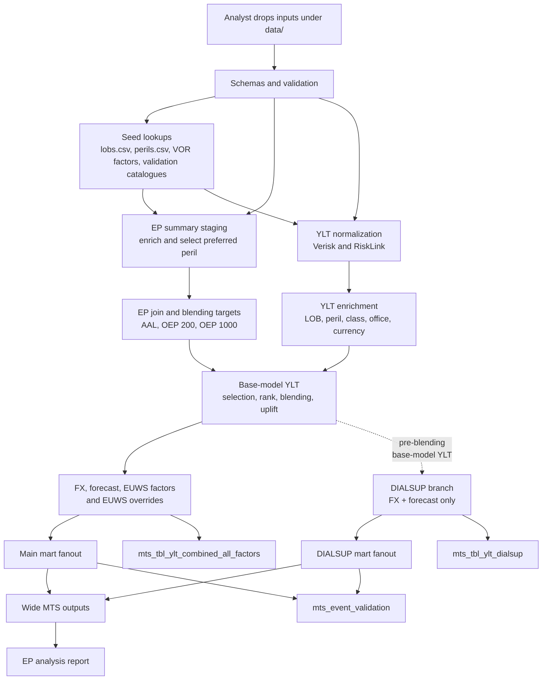

# Architecture

The rollup pipeline is a file-based batch process. Analysts drop source inputs
under `data/`; the CLI validates them, enriches vendor YLT rows with seed
lookups, derives EP-driven blend factors, applies business factors, and writes
mart/report outputs under root `output/`.

## Data flow

## Pipeline phases

| Phase | What happens | Debug prefix |
| --- | --- | --- |
| Seed + validation | Read seed files, event catalogues, YLTs, and EP summaries; report schema and lookup coverage issues. | `seed_*` |
| Staging | Normalize YLT formats and stage EP summaries with LOB/peril enrichment and preferred modelled peril selection. | `stg_*` |
| Intermediate | Join EP vendors, calculate blend targets, enrich YLT rows, apply blending, FX, forecast, EUWS, and build DIALSUP. | `int_*` |
| Marts | Build main/DIALSUP fanouts, combined-all-factors output, event validation, and wide MTS. | `mts_*` |

## Forecast factor and output shaping

The forecast step expands each YLT row across all forecast dates:

1. All unique `forecast_date` values from `forecast_factors.csv` are extracted.
2. Each YLT row is cross-joined with those dates — 1 input row becomes N output rows.
3. The forecast factor is left-joined on `(class, office, forecast_date)`. Missing factors default to `1.0`.
4. The forecasted loss = `original_ylt_loss_blended_gbp * forecast_factor`.

**Long output** (`mts_tbl_ylt_combined_all_factors.parquet`): one row per (event × forecast_date), with columns for each intermediate loss stage (`original_ylt_loss`, `_blended`, `_gbp`, `_forecast`, `_euws`) and the contributing factor values (`forecast_factor`, `fx_rate`, `euws_factor`, `uplift_factor_on_base_model`).

**Wide output** (`mts_tbl_ylt_combined_all_factors_wide.parquet`): the same data pivoted so each forecast date becomes a separate column per metric — e.g. `main_202601_loss`, `main_202602_loss`, `dialsup_202601_loss`. Dimension columns (vendor, rollup_lob, rollup_peril, etc.) remain as row identifiers.

## Pipeline transforms

| # | Step | Function | Input | Output | Key columns created | Purpose |
|---|------|----------|-------|--------|---------------------|---------|
| 1 | Normalize YLT | `normalize_ylt` | Raw Verisk/RiskLink YLT parquets | Normalized YLT | `vendor`, `modelled_lob`, `modelled_peril`, `loss`, `year_id`, `event_id` | Standardise vendor column names to canonical schema |
| 2 | Stage EP summaries | `stage_ep_summaries` | EP long CSVs + seeds | Staged EP summaries | `rollup_lob`, `rollup_peril`, `cds_cat_class_name`, `class_`, `office`, `currency` | Enrich EP data with seed lookups and select one modelled peril per (vendor, rollup_lob, rollup_peril) |
| 3 | Join EP vendors | `join_ep_summaries` | Staged EP summaries | Joined EP summaries | `verisk_loss`, `risklink_loss` | Aggregate EP losses per vendor at `(rollup_lob, rollup_peril, region_peril_id, ep_type, return_period)` grain |
| 4 | Calculate blend targets | `calculate_ep_blending_targets` | Joined EP summaries + `blending_factors.csv` | Blending targets | `target_loss`, `base_model`, `base_model_loss`, `uplift_factor_on_base_model` | Compute blended EP target and uplift factor per RP bucket, clamped to [0.1, 10.0] |
| 5 | Enrich YLT | `enrich_ylt_with_ep_summaries` | Normalized YLT + staged EP summaries | Enriched YLT | `rollup_lob`, `rollup_peril`, `region_peril_id`, `cds_cat_class_name`, `class_`, `office`, `currency` | Attach seed enrichment columns to each YLT row via inner join |
| 6 | Blend YLT | `apply_ep_blending_to_ylt` | Enriched YLT + blending targets | Blended YLT | `rnk`, `rp`, `rp_bucket`, `original_ylt_loss`, `original_ylt_loss_blended` | Rank events within `(vendor, modelled_lob, rollup_peril)`, bucket by RP, apply uplift factor |
| 7 | Apply FX | `apply_fx_to_ylt` | Blended YLT + `fx_rates.csv` | FX-applied YLT | `fx_rate`, `target_currency`, `original_ylt_loss_blended_gbp` | Convert blended loss to GBP |
| 8 | Apply forecast | `apply_forecast_to_ylt` | FX-applied YLT + `forecast_factors.csv` | Forecast-applied YLT | `forecast_date`, `forecast_factor`, `original_ylt_loss_blended_gbp_forecast` | Cross-join forecast dates, apply class/office multipliers |
| 9 | Apply EUWS | `apply_euws_to_ylt` | Forecast-applied YLT + Verisk events + `euws_rate_factors.csv` | EUWS-applied YLT | `model_event_id`, `event_day`, `euws_factor_raw`, `euws_factor` | Map Verisk events, apply Europe Windstorm event factors |
| 10 | Apply EUWS overrides | `apply_euws_overrides_to_ylt` | EUWS-applied YLT + `euws_rank_overrides.csv` | Override-applied YLT | `euws_override_applied`, `original_ylt_loss_blended_gbp_forecast_euws` | Override EUWS factor to configured value for top-ranked zero-factor events |
| 11 | Build DIALSUP | `calculate_dialsup` | Base-model YLT + Verisk events + `fx_rates.csv` + `forecast_factors.csv` | DIALSUP YLT | `dialsup_original_ylt_loss`, `dialsup_loss_gbp`, `dialsup_loss_gbp_forecast` | Build DIALSUP branch (raw loss + FX + forecast, no blending or EUWS) |
| 12 | Main fanout | `build_main_fanout` | Override-applied YLT + RiskLink flood events | Main fanout | `ModelEventID`, `ModelYear`, `CurrencyCode`, `ModelGrossLoss`, `ModelEventDay` | Format mart-ready output with standard fanout column names |
| 13 | DIALSUP fanout | `build_dialsup_fanout` | DIALSUP YLT + RiskLink flood events | DIALSUP fanout | Same fanout columns | Format mart-ready output for DIALSUP |
| 14 | Combined all-factors | `build_ylt_combined_all_factors` | Override-applied YLT | `mts_tbl_ylt_combined_all_factors` | All intermediate loss and factor columns | Select all intermediate columns for inspection |
| 15 | DIALSUP wide | `build_ylt_dialsup_wide` | DIALSUP YLT | `mts_tbl_ylt_dialsup` | DIALSUP-specific columns | Select DIALSUP columns |
| 16 | Wide MTS | `build_ylt_combined_all_factors_wide` | Combined all-factors + DIALSUP wide | `mts_tbl_ylt_combined_all_factors_wide` | `main_YYYYMM_loss`, `dialsup_YYYYMM_loss` | Pivot forecast dates into wide columns per metric |

Normal runs write only final outputs. Use `uv run rollup run --debug` when you
need intermediate parquet frames in `output/debug/`.
