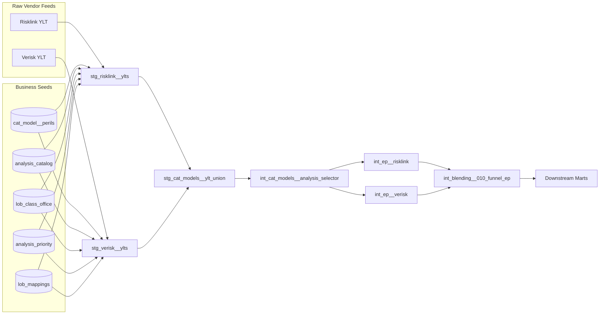

# CAT Model Data Schematic

This document captures how catastrophe-model YLT inputs, business seeds, and EP outputs tie together so MkDocs readers can see the full lineage for the `modelled_lob × class × office × peril` reporting grain.

## Overview

- Vendors deliver multiple YLT analyses per peril; we standardize them to a canonical business grain before EP calculations.
- Seed files hold the business logic (peril vocabulary, LOB/Class/Office requirements, analysis metadata, selection priorities, vendor mappings).
- Staging models normalize raw feeds using those seeds, then intermediate models pick the correct analysis per combo and run `ep_curve_from_ylt`.
- Blending models union vendor EP curves into a single funnel for downstream marts.

## Seed Inventory

| Seed | Purpose | Primary Key | Key Columns | Relationships/Notes |
| --- | --- | --- | --- | --- |
| `cat_model__perils` | Canonical peril glossary + return-period defaults | `peril_code` | `peril_group`, `description`, `default_return_periods`, vendor mapping columns | Referenced by every other seed/model via `peril_code`. |
| `cat_model__analysis_catalog` | Registry of vendor analyses and attributes | `analysis_catalog_id` | `vendor`, `source_analysis_name`, `analysis_id`, `peril_code`, `model_code`, `analysis_type`, `lob_type`, `run_variant`, `is_reporting_default`, `effective_from`, `effective_to` | FK to `cat_model__perils.peril_code`; used by staging to enrich raw YLTs. |
| `cat_model__analysis_priority` | Business rule for picking the right analysis per `lob_type`/peril | Composite (`lob_type`, `peril_code`) | `preferred_analysis_type`, `fallback_analysis_type`, `max_analysis_age_months` | Consumed by selector model to filter analyses. |
| `cat_model__lob_mappings` | Vendor → canonical LOB/Class/Office translation | Composite (`vendor`, `source_lob_value`) | `modelled_lob`, `class_name`, `office` | Supports staging normalization before joining to LCO seed. |

Add these seeds (CSV) under `dbt/seeds/cat-models/` with a shared `_cat_models__seeds.yml` that defines uniqueness, relationship, and accepted-value tests so referential integrity is enforced at seed load.

## Data Flow Diagram (Mermaid)



## Relationship Schematic (ASCII)

```
                +----------------------+
                |  cat_model__perils   |
                +----------+-----------+
                           |
                           | (peril_code)
                           v
    +------------------------------+          +--------------------------+
    | cat_model__analysis_catalog  |<-------->| cat_model__analysis_     |
    | (one row per vendor analysis)|          | priority                 |
    +------+---------+-------------+          +--------------------------+
           |         | (lob_type)                       ^
           |         v                                  |
           |   +---------------------------+            |
           |   | cat_model__lob_mappings   |            |
           |   +-------------+-------------+            |
           |                 |                          |
           v                 v                          |
    +-------------------------------+                    |
    | cat_model__lob_class_office   |--------------------+
    | (LOB × class × office × peril)|  ensures every combo
    +-------------------------------+  has priorities
```

## Processing Stages

1. **Staging Normalization**
   - Risklink and Verisk YLTs join to `cat_model__lob_mappings` for LOB alignment.
   - `cat_model__analysis_catalog` adds vendor, peril, and analysis metadata.
   - `cat_model__lob_class_office` ensures every record maps to a required reporting combo; mismatches fail tests early.
2. **Analysis Selection**
   - `int_cat_models__analysis_selector` evaluates the unioned staging rows against `cat_model__analysis_priority` to keep exactly one analysis per `modelled_lob/class/office/peril`.
3. **EP Calculation**
   - `ep_curve_from_ylt` uses `cat_model__perils.default_return_periods` to produce a consistent RP set for both vendors, keyed by analysis metadata.
4. **Blending Funnel**
   - `int_blending__010_funnel_ep` unions vendor EP curves, adds required business metadata, and surfaces a single contract for downstream marts.

## Maintenance Notes

- When onboarding a new analysis run, add it to `cat_model__analysis_catalog` and (if necessary) update `cat_model__analysis_priority` to point to the new `analysis_type` for the relevant `lob_type`/peril pairs.
- To expand coverage (new office/class combinations), seed `cat_model__lob_class_office` first, then ensure staging models produce data for that combo; dbt tests will flag missing rows.
- Vendor taxonomy changes (e.g., new Risklink LOB codes) should be handled in `cat_model__lob_mappings`, keeping model SQL stable.
- Keep MkDocs documentation synchronized: whenever a seed structure changes, update this schematic plus the `_cat_models__seeds.yml` descriptions so data consumers have a single source of truth.

## Next Steps

1. Implement the proposed seeds under `dbt/seeds/cat-models/` with real business data.
2. Wire staging models to consume the seeds and enforce tests.
3. Review the EP macro output to make sure return-period arrays from `cat_model__perils` cover all required RPs for MGA/Property/FA reporting.
