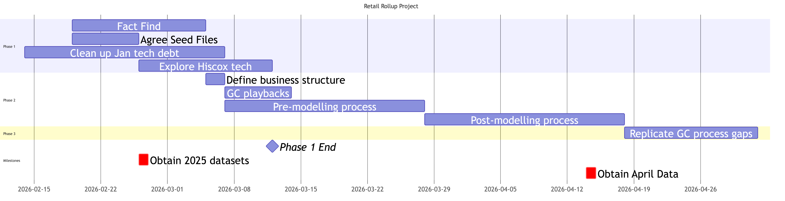
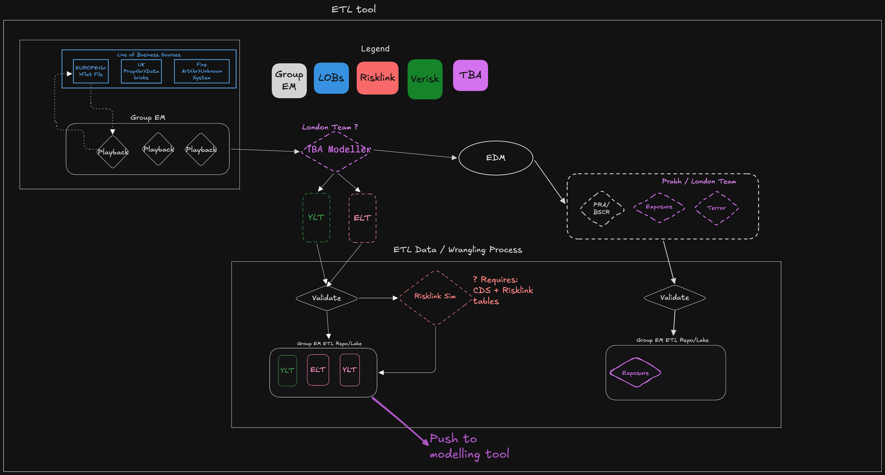
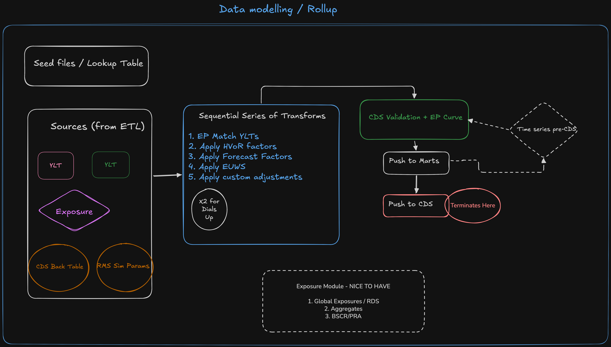

---
title: "UK & EU Group Retail Rollup Process: Enhancement Proposal"
author: Richard Hampton
date: 2026-02-24
format:
  pdf:
    toc: true
    number-sections: true
    colorlinks: true
    include-in-header:
      text: |
        \usepackage{pdflscape}
---




## Executive Summary

The objective of this project is to develop a rollup process that can be transferred
to an analyst with reasonable SQL and modelling experience. This should enable
greater frequency of reporting — from annual to quarterly — and therefore
improve the credibility and timeliness of results.

In order to achieve this, and based on learnings from the January 2026 rollup process,
several foundational steps must be completed first.

The project is structured into three phases. The final phase remains open-ended, as
there are systems and processes not yet fully understood; it is therefore expected that
additional issues will surface requiring resolution in Phase 3.

A number of operational requirements detailed in Section 4 will be required.
Ideally, these will be agreed rather than workarounds being done.


### Tech choices
- Analysis DB: Duckdb or Databricks
- ETL: Python cleansing scripts
- Data source management: Required to validate data - CLI tool possibly Dataiku
- Orchestrator: Too complex for this project.

### Project Phases

**Phase 1: Current — March**

Phase 1 is already underway and focuses on fact-finding and system setup.
During this phase, work is ongoing with business units to review the data they currently
produce, the frequency at which it can be delivered, and the cleansing steps required.

1. Map out data sources
2. Define acceptable data formats
3. Replicate the Guy Carpenter (GC) methodology to cleanse data
4. Agree analyst resource to assist with physically modelling the exposure data and
   to provide feedback on the data formats being produced

**Phase 2: Mid-March — End of April**

Replicate the January 2026 rollup post-modelling process into a cleaner, maintainable
system. Bring together the outputs from Phase 1 into a coherent repository.

**Phase 3: May — June**

Resolve currently unknown issues or fill reasonable gaps uncovered during Phases 1 and 2.
Additionally some of the data transacted between various systems at this point
has gone through multiple ETL/ELT transformations. Phase 3 is a good place
to take a step back and review them once more.



```{=latex}
\begin{landscape}
```

### Project Timeline

{fig-align="center" width=100%}

```{=latex}
\end{landscape}
```


## Success criteria
1. Data sources have been mapped and documented ETL process to produce
cat model inputs
2. Replication of GC work and playback reports
3. Cat model resource knows the defined data format and how to execute the
modelling workflow
4. ELT process documented and defined to produce the required CDS inputs.

### Nice-to-haves
Exposure based metrics such as Global Exposures, aggregates, various inputs for
RDS, BSCR, PRA returns. It is unlikely a robust process to produce all of these
can be accomplished. Instead the clean exposure datasets produced above
would enable this analysis to be done in future.

## Costs

Compute and storage costs are not expected to be significant. The rollup generated
single-digit gigabytes of data and some of this was not optimised.

- Quarterly rollup size: 2–10 GB
- Runtime: 20 minutes – 2 hours (local execution)

Costs on Databricks for this will be small. Costs using a local database like
Duckdb will be zero.



## Governance Recommendations

The most important unresolved issue identified to date is the absence of Standard
Operating Procedures (SOPs), runbooks, and checklists, combined with a lack of
formal review processes. Without these controls, even a well-engineered system will
be prone to failure.

The following actions are recommended for Hiscox management:

1. **Mandate the use of SOPs and runbooks**, stored and reviewed in a central version-controlled repository.
2. **Rigorously enforce managerial review practices** with multiple defined checkpoints throughout the process.

### Background: Lessons from January 2026

The principal issues encountered during the January 2026 rollup stemmed from a lack
of documentation and repeatable inputs:

- Inconsistent application of model settings and naming conventions year-on-year,
  which meant previous work could not be reproduced.
- Identifying where, when, and what had been done previously was extremely difficult
  in all cases.
- Files were scattered across network drives with no defined conventions and no recent
  documentation.
- Results were difficult to audit as Group Retail did not source the data directly,
  receiving it instead from Guy Carpenter.
- No defined review processes or checkpoints to prevent work proceeding on incorrect
  or unsatisfactory methodology and data.
- Friction and rework caused by legacy GUI-only tools; multiple issues were encountered,
  all of which are readily solvable.

Some of these issues are not caused by, nor solely fixable by, the Group Retail team.
They do not own the underlying systems and are often several steps removed from the
production of source data, which makes explaining results challenging.

### Tertiary Outputs

There are a number of tertiary outputs produced as part of the rollup process:

- Internal RDS aggregates
- Lloyd's RDS
- BSCR / PRA exposure outputs

In almost all cases these were undocumented from previous years. Some calculations
are suspected to require rebuilding — for example, the internal global exposures —
as the input data may be corrupted and the calculation script itself is not maintainable.

### Additional Outputs Not Currently Produced

Simple aggregation analysis at the state, city, and regional level is not currently
produced. This makes analysis of model movements more difficult and prevents loss
numbers from being contextualised.

Similar figures are frequently required to produce regulatory and tertiary outputs;
as such, this represents a suite of outputs that Group Retail should aim to produce
systematically.



## Operational Requirements

In addition to the governance matters above, there are a number of relatively
straightforward changes that Hiscox could implement to have an immediate positive
impact on the smoothness of the Group rollup:

1. **Define responsibilities and timelines** for the delivery of raw data from
   business units.

2. **Clarify the requirements of the CDS system.** The lookup tables used in this
   system should be made immediately available to the retail team to minimise problems
   with importing invalid data to CDS.

3. **Chnges to CDS System** Any changes to the CDS system should follow their
own governance process which should include informing the Group Retail team.
Any changes to CDS can and will prevent smoothly uploading the information and
precipitate workarounds which will have a high potential to end up being
undocumented.

4. **Agree ownership of the modelling process** in Touchstone and Risklink.
   By extension, the data format to be delivered to, and produced by, the modeller
   will be formally agreed.

5. **Produce checklists and results templates** to aid managerial review and to give
   the analyst running the process clear criteria for completion.

6. **Implement modern analytical database tooling and version control.** These must
   become standard practice to ensure the systems do not deteriorate over time.
   Managers must enforce this or they will inevitably fall into disuse, ending
   back at undocumented and uncontrolled procedures.



## Technical Architecture

This section details the technical components of the proposed process and the current
approach.

### Data Flow Overview

This section describes the current thinking around data flow based on what
was done in January 2026 and meeting with the business units.

### ETL Process

The disparate and changeable data sources, in their current state, may require an
ETL process that cannot be fully contained within Databricks. This will be avoided
where possible. Reduced flexibility is considered acceptable in this context — it
enforces a clearly defined standard for what inputs are acceptable.

**Note:** The catastrophe modelling process is included within the ETL scope.



*This schematic was produced prior to the adoption of Databricks; the technical
implementation will change accordingly. The primary purpose here is to illustrate
the workflow upstream of modelling and the application of the Hiscox View of Risk (VoR).*

Key observations:

1. There are multiple playback points to business units, currently managed by GC.
2. There is no defined process for modelling risks using in-house systems.
3. An alternative simulation engine is in use to avoid reliance on Tomcat.
4. Pulling data from the back tables of CDS is required to correctly model Risklink
   and validate the inputs.

### Pre-Modelling

A significant portion of the work involves generating exposure data, validating it,
and playing it back to business units — a role currently performed by GC. Bringing
this pre-modelling checking and data manipulation step in-house would expedite the
rollup significantly.

**Note:** Hiscox Group is unlikely to see these intermediate outputs directly, but
their accuracy is a prerequisite for reliable final results.

### ELT and Data Modelling

Once the data sources have been loaded, the process transitions to a structured
data modelling workflow. The goals of this stage are to:

- Systematically apply the Hiscox View of Risk (VoR), forecast factors, and
  various uplift factors
- Generate two output streams: one for the internal rollup and one for the
  dials-up view
- Optionally: generate aggregates and global exposures





## Current Scope Limitations

Due to a small number of process constraints, it is not currently possible to deliver
a fully end-to-end automated workflow. The specific limitations are as follows:

1. **Exposure data playback to business units.** This step arguably belongs with
   the business units themselves. The existing practice is for GC to load raw exposure
   data and return exposure reports with time series analysis.

2. **Production of model results via Risklink or Touchstone** currently requires
   manual file loading. Options for automation exist but will be constrained by
   the capabilities of the existing modelling platforms.

3. **The final upload to CDS is a manual process.** A live staging area, auto-loading
   pipeline, or web API integration is not currently available.


## Review meetings
I suggest we hold fortnightly review meetings initially. As issues may crop up
that require Hiscox to make decisions or assist in solving roadblocks.

