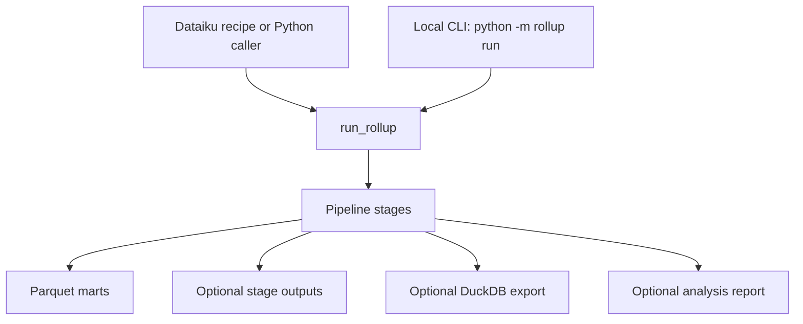

# Runtime guide

This page explains how the current rollup system works end-to-end. The runtime
is Dataiku-first, with a small local CLI for development, smoke testing, and
analyst operation outside Dataiku.

## Runtime entry points



### Programmatic API

- `run_rollup(data_root="data", output_root="output", ...)` runs all calculation
  stages, optional DuckDB export, and optional analysis report generation.
  Dataiku callers should pass `config_path` explicitly, usually from a job
  workspace or managed-folder path.
- Validnator owns input/schema validation. The runtime does not duplicate those
  contracts; it keeps business invariant checks that require computed or joined
  data.
- `convert_ep_summary(input_csv, vendor, output_csv=None)` converts one wide EP
  summary CSV to canonical long rows, returns a Polars `DataFrame`, and writes a
  CSV only when `output_csv` is supplied.

Programmatic callers receive concrete paths from `result.outputs`: combined,
wide, DIALSUP, mart fanouts, optional stage directory, and
optional DuckDB file. See [Programmatic API](programmatic-api.md) for the
Dataiku workspace pattern.

### CLI examples

```bash
uv run python -m rollup run --data-root data --output-root output --target-currency GBP
uv run python -m rollup run --data-root data --output-root output --target-currency GBP --no-stage-outputs --no-analysis
uv run python -m rollup run --data-root data --output-root output --target-currency GBP --duckdb
uv run rollup generate-ep-summaries --vendor verisk --csv verisk_clean.csv
```

Logs default to `<output-root>/rollup.log`, unless `--log-file` is supplied. The
success summary prints absolute paths, mart parquet counts, analysis report
status, stage output status, and DuckDB status.

## Inputs

```text
data/
  ylt/verisk/*.parquet
  ylt/risklink/*.parquet
  ep_summaries/**/*.long.csv
  seeds/business/lobs.csv
  seeds/business/perils.csv
  seeds/vor/blending_factors.csv
  seeds/vor/fx_rates.csv
  seeds/vor/forecast_factors.csv
  seeds/vor/euws_rate_factors.csv
  seeds/adjustments/euws_rank_overrides.csv
  seeds/validation/verisk_events.parquet
  seeds/validation/risklink_flood22_model_events.parquet
```

`perils.csv` must contain `base_model`, `blend_subregion_peril_id`,
`selection_priority`, `is_dialsup`, and `is_euws`. `base_model` chooses the
vendor base model for blending, `blend_subregion_peril_id` chooses the VOR
`SubRegionPerilID` used for blend weights, `selection_priority` chooses the main
EP peril candidate, `is_dialsup` flags the selected modelled peril row for the
DIALSUP branch, and `is_euws` controls EUWS factor application.

## Output layout

```text
output/
  marts/
    mts_tbl_ylt_combined_all_factors.parquet
    mts_tbl_ylt_combined_all_factors_wide.parquet
    mts_tbl_ylt_dialsup.parquet
    HiscoAIR_..._main.parquet
    HiscoRMS_..._main.parquet
  stages/
    staging/
    intermediate/
  analysis/
    ep_report.csv
  rollup.log
```

- `--no-stage-outputs` disables `output/stages/` writes.
- `--no-analysis` disables `output/analysis/ep_report.csv`.

## Calculation flow

The pipeline executes these stages in order:

1. `load_sources` reads YLT parquets, EP long CSVs, business seeds, VOR seeds,
   adjustment seeds, and validation catalogues.
2. `normalize_ylt` converts Verisk and RiskLink YLTs to common YLT columns.
3. `stage_ep_summaries` joins LOB/peril seeds and selects the lowest
   `selection_priority` per `(vendor, rollup_lob, rollup_peril)`, while
   preserving `is_dialsup` and `is_euws` from the selected modelled peril row.
4. `build_enriched_ylt` enriches normalized YLT rows from the staged EP summary
   mapping. RiskLink raw YLT is keyed by analysis id, so modelled dimensions
   should come from EP summary enrichment.
5. `apply_blending` restores EP-derived blending from the old master: configured
   target points, blend weights, target loss, base model, base model loss,
   clipped uplift factor, and rank/RP bucket joins.
6. `apply_fx` converts blended loss to the explicit target currency.
7. `apply_forecast` cross-joins every forecast date and uses factor `1.0` when a
   class/office/date factor is absent.
8. `apply_euws` applies event-based EUWS factors to rows where `is_euws == 1`
   and applies rank overrides.
9. `build_metric_long` creates the combined long metric mart.
10. `build_dialsup` creates DIALSUP from original YLT loss multiplied by FX and
    forecast factors, not EUWS-adjusted loss. Rows are selected by
    `is_dialsup == 1`.
11. `write_marts` writes combined, wide, DIALSUP, and fanout parquet files.

## Metrics and lineage

Combined long metrics:

- `loss_original_ylt`
- `loss_blended`
- `loss_blended_fx_gbp`
- `loss_blended_fx_gbp_forecast`
- `loss_blended_fx_gbp_forecast_euws_override`

DIALSUP metric:

- `loss_dialsup_fx_gbp_forecast`

Changing the target currency changes the metric tag. For example, USD produces
metric names containing `_fx_usd_...`.

## Wide output contract

`mts_tbl_ylt_combined_all_factors_wide.parquet` is a true wide pivot of the
combined all-factors mart:

- It has no `metric`, `forecast_date`, or `loss` columns.
- Row dimensions are all non-measure dimensions, including `target_currency` and
  `is_dialsup`.
- Value columns are `{metric}_{forecast_date_without_hyphens}`.

Example columns:

- `loss_original_ylt_20260101`
- `loss_blended_20260101`
- `loss_blended_fx_gbp_20260101`
- `loss_blended_fx_gbp_forecast_20260101`
- `loss_blended_fx_gbp_forecast_euws_override_20260101`

DIALSUP remains in `mts_tbl_ylt_dialsup.parquet`; it is not included in the
combined wide mart.

## DuckDB export

DuckDB export is optional and disabled by default.

CLI flags:

- `--duckdb` writes the default database.
- `--duckdb-file <path>` writes a specific database path and also enables DuckDB.

Config:

```toml
[outputs]
write_duckdb = true
duckdb_file = "rollup.duckdb"
```

Default path: `output/rollup.duckdb`.

Tables included:

- `mts_tbl_ylt_combined_all_factors`
- `input_ylt_verisk`
- `input_ylt_risklink`
- `input_ep_summaries`
- `seed_lobs`
- `seed_perils`
- `seed_blending_factors`
- `seed_fx_rates`
- `seed_forecast_factors`
- `seed_euws_rate_factors`
- `seed_euws_rank_overrides`

Not included: fanouts, stage/intermediate outputs, DIALSUP mart, and wide mart.

## Validation behavior

- Validnator owns required-file, schema, dtype, and nullability validation for
  runtime inputs.
- The runtime no longer exposes `validate_rollup_inputs` or Pandera schemas.
- Missing files that the runtime needs to execute still fail normally.
- Business invariant checks remain in runtime code, including base-model loss,
  FX-rate, empty-blending-factor, target-point, and vendor-loss guards.
- Unexpected errors are not hidden; they propagate.

## Reference smoke values

These values are reference smoke checks against real `./data`, not hard
guarantees. Small floating-point differences are expected.

Combined sums:

- `loss_original_ylt` ≈ `595,127,587,394.46`
- `loss_blended` ≈ `579,116,007,376.25`
- `loss_blended_fx_gbp` ≈ `577,222,053,036.84`
- `loss_blended_fx_gbp_forecast` ≈ `566,796,627,725.94`
- `loss_blended_fx_gbp_forecast_euws_override` ≈ `566,250,261,028.68`

EP AAL:

- main/EUWS ≈ `11,175,803.275055`
- DIALSUP ≈ `12,772,490.495922`

Calculations now match Jun6 master within float noise, while output shape and
metric names are modernized.

## Known issues and follow-ups

- `Pen` and `Cherish` RiskLink output rows currently have null `modelled_lob` and
  `modelled_peril` despite EP summaries containing `MGA_Pen` and `MGA_Cherish`.
  Likely follow-up: `build_enriched_ylt` drops those fields from RiskLink EP keys
  before joining by `analysis_id`.
- DIALSUP fanout files are not emitted separately.
- Add an explicit error when EP blending weights are missing for a required
  region peril.
